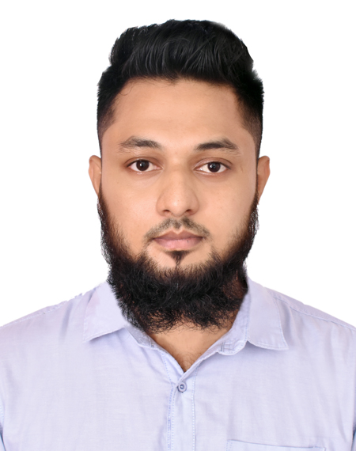

<!-- banner image starts here  -->

<!-- banner image ends here  -->

<h1> 👋 Hello, I'm Al Amin Raju </h1>

Full stack developer

<!-- Contact me section starts here  -->

 
 

<!-- Contact me section ends here  -->

<!-- about-me section starts here  -->

### 👨‍🏫 &nbsp; About Me

I am passionate full stack developer. I try to take on new challenges and love to solve real world problems. I am strategic, goal-oriented and always work with an end goal in mind. Over the years, I have worked with several clients and successfully met their requirements. I pride myself on quality work and maintain excellent communication. Every day I try to learn something new. I mostly work with Python, JavaScript & PHP. I love technology.

 

<!-- about-me section end here -->

<!-- skills section starts here  -->

### 🛠 &nbsp; Skills:

- Front-end : HTML, CSS, SASS, Bootstrap, Materializecss, JavsScript, TypeScript, JQuery, AJAX, VueJS
- Backend : Python, PHP, Django, Django Rest Framework, Laravel, Lumen
- DBMS: MySQL, PostgreSQL
- Software build tool: Docker
- Application server: Apache
- Data serialization language: JSON, YAML
- Version congrol system: Git, Bitbucket
 
 

<!-- skills section starts here  -->

<!-- work experience section starts here  -->

### 💼 &nbsp; Employment History

| Position            | Institute                                   | Duration            | Location           |
| ------------------- | ------------------------------------------- | ------------------- | ------------------ |
| Software Engineer   | Crowdbotics                                 | Aprl 2022 - Present | Berkeley, CA, USA  |
| Software Developer  | Dream71 Bangladesh Limited                  | Aug 2021 - Dec 2021 | Dhaka, Bandladesh  |
| Software Developer  | Business Automation Limited                 | Jun 2019 – Jul 2021 | Dhaka, Bangladesh  |

 
<!-- work experience section starts here  -->

<!-- education section starts here  -->

### 👨🏻‍🎓 &nbsp; Education

   B.Sc. in Computer Science & Engineering  
   Eastern University  
   Dhaka, Bangladesh.

 

<!-- education section ends here  -->

<!-- my languages section starts here  -->

### 🌍 &nbsp; Languages:

- 🇧🇩 Bangla : Native
- 🏴󠁧󠁢󠁥󠁮󠁧󠁿 English : Fluent
- 🇮🇳 Hindi : Intermediate

 

<!-- my languages section ends here  -->

<!-- my sports and game section starts here  -->

### 🙍‍♂️ &nbsp; Sports / Game / Activities / Hobby:

- 🏏 Cricket, ⚽ Football, 🏸 Badminton, ♟️ Chess, 🏐 Volleyball
- 🏊‍♂️ Swimming, 🏃‍♂️ Running, 🚶‍♂️ Walking
- ✈️ Travelling

 

---

Thanks for going through my Portfolio.

---
